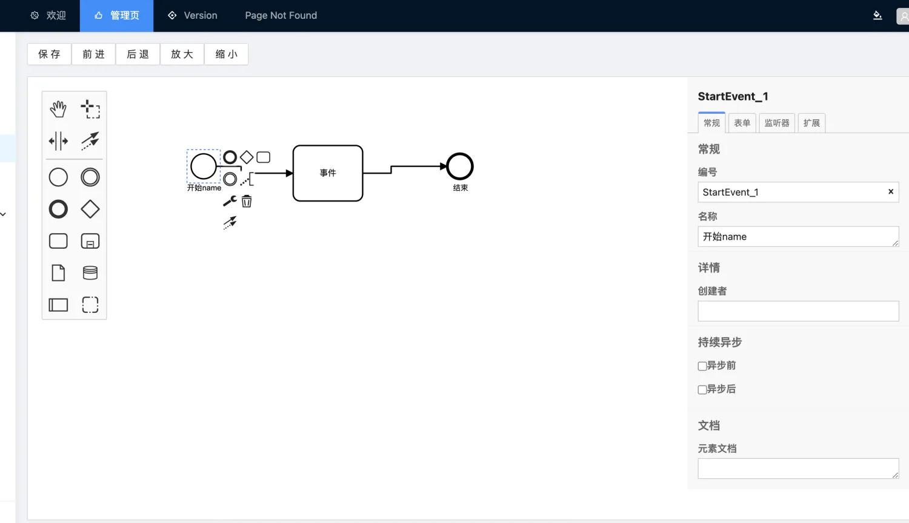

# bpmn-web 管控端

## 介绍

基于 vue 3 + ts + pro-layout + antdv + antv + bpmn js 的低代码应用引擎 micro application engine（微应用引擎） 用户界面平台

## 安装

```
yarn
```

## 启动

```
yarn dev
```

## bpmn.js--流程编排设计 效果图



## 参考资料

- [Bpmn.js 中文文档](https://blog.csdn.net/weixin_43359503/article/details/113915655)
- [Bpmn.js--浏览页面](https://designer.bpmport.com/designer/)
- [流程设计模板](https://www.mscodecloud.com/mscodevue/#/activiti/processdesign?modelId=8c482cb3-683f-11ea-887f-721ce77cfa9c&deploymentId=eb00f7d6-6846-11ea-887f-721ce77cfa9c)
- [vue3 集成 bpmn-js——适配 activiti 工作流 ](https://blog.csdn.net/qq_34731982/article/details/121398869)
- [bpmn.js 基础篇(二)-自定义 Palette(1)](https://zhuanlan.zhihu.com/p/428391444)
- [bpmn-js 改造（一）添加会签节点 ](https://blog.csdn.net/weiyongliang_813/article/details/112425504)
- [在 vue 中使用 bpmn-js（进阶）](https://www.jianshu.com/p/03bde934a523)
- [全网最详 bpmn.js 教材-自定义 contextPad 篇](http://events.jianshu.io/p/9c8149295d25)
- [全网最详 bpmn.js 教材-自定义 renderer 篇](https://juejin.cn/post/6844904020973207559)
- [全网最详 bpmn.js 教材-自定义 contextPad 篇](https://juejin.cn/post/6844904025171689479)
- [全网最详 bpmn.js 教材-properties 篇](https://www.jianshu.com/p/d735024e66d0)
- [Vue3.0+bpmn.js+国际化(一)](https://blog.csdn.net/sxmzhw/article/details/133297776)
- [gitHub 地址](https://github.com/MavisYang/bpmn-web-2024.7.19)
- [mac-使用 ngrok 实现项目本地部署公网访问（内网穿透）](https://juejin.cn/spost/7394643241852190747)
- [掘金自行整理 bpmn.js--流程编排设计 ](https://juejin.cn/spost/7394652965908512819)

## TODO

1.  增加按钮指令 v-working，实现异步方法时自动进入加载（不可用）状态
2.  完善代码生成器前端剩余工作
3.  根据代码生成器生成系统管理的栏目管理（树状表格）
4.  根据栏目管理数据加载动态路由配置
